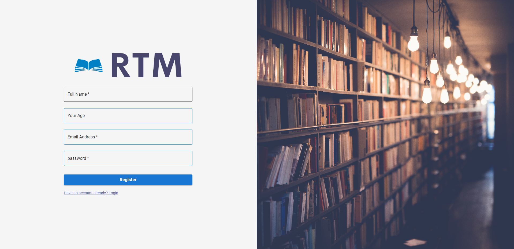
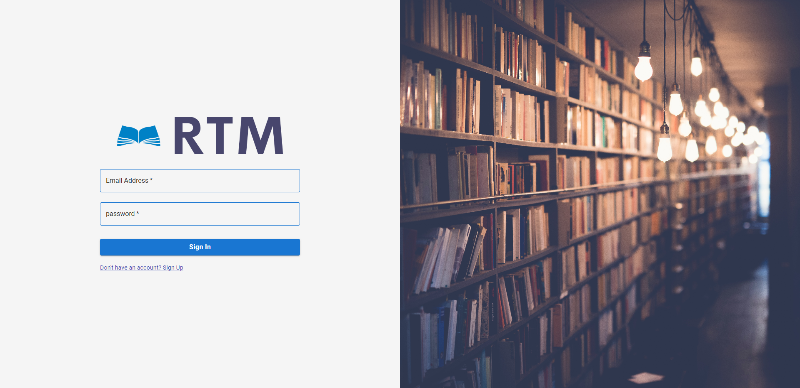
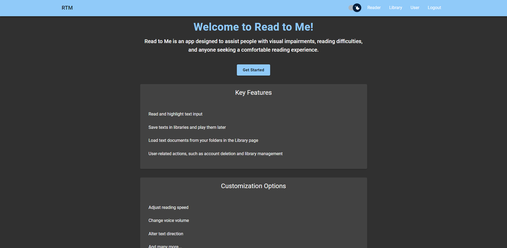
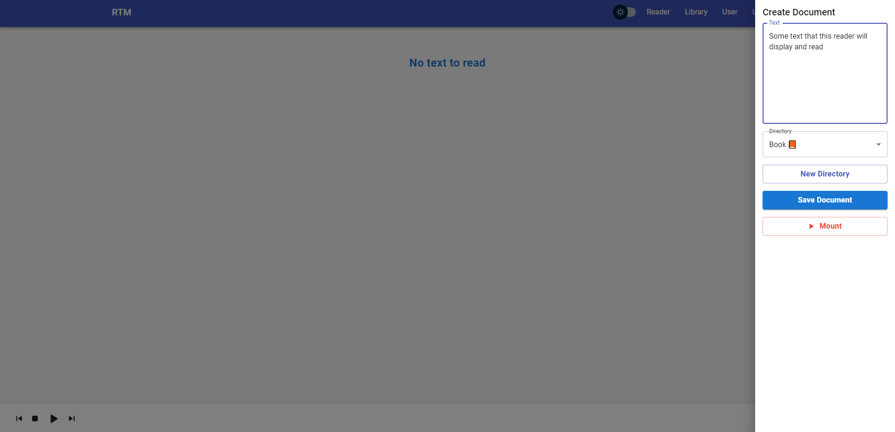
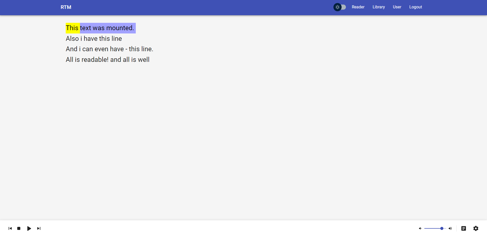
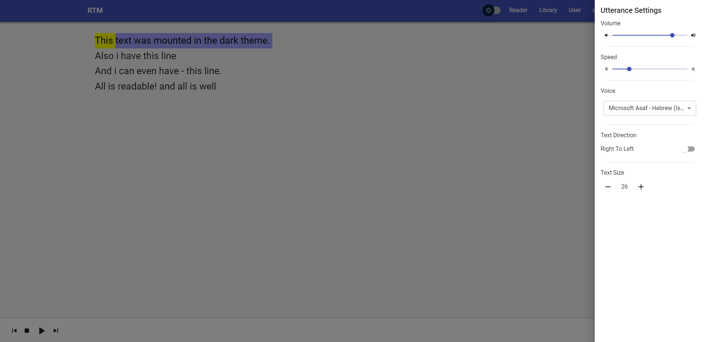
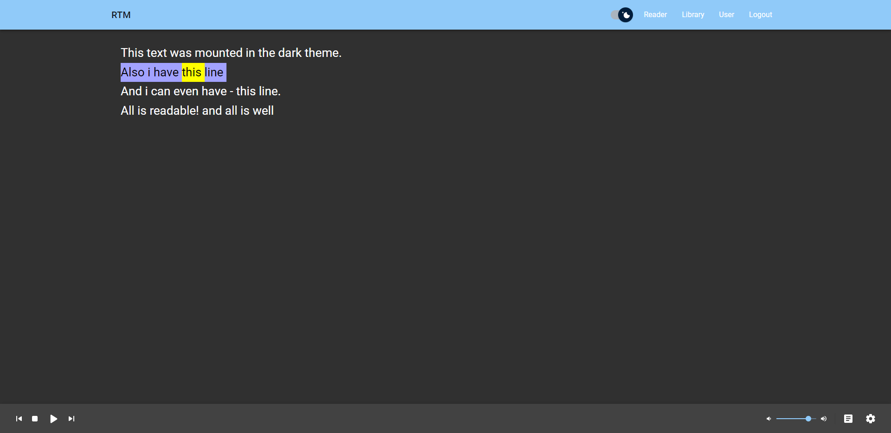
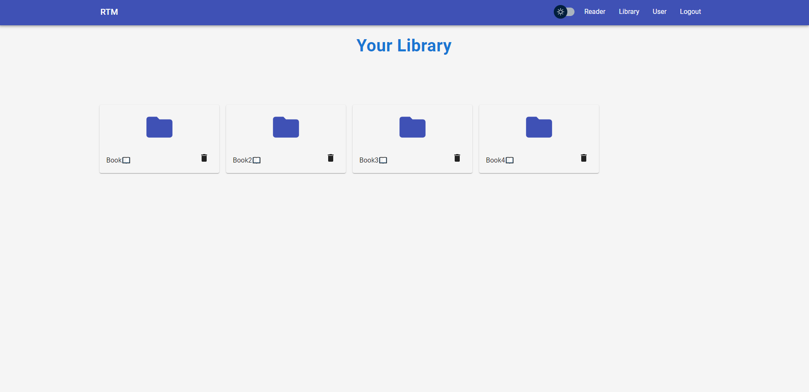
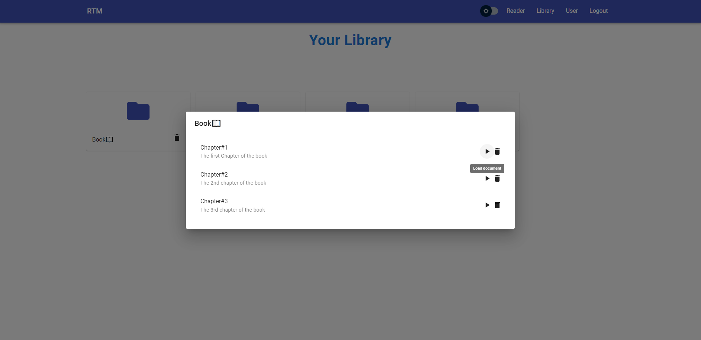
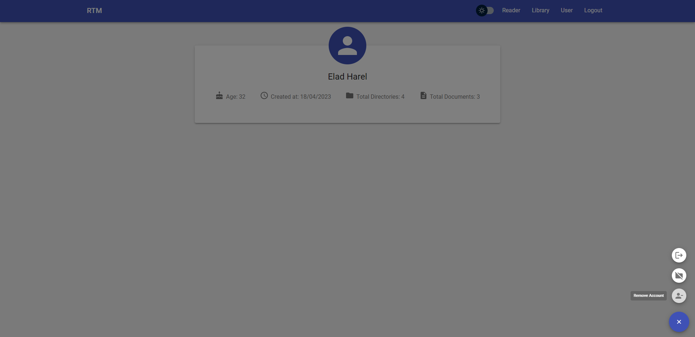

## Read To Me: An App for Comfortable Reading Experiences

Read To Me is a MERN stack app designed to assist people with visual impairments, reading difficulties, and anyone seeking a comfortable reading experience. With text-to-speech functionality, adjustable reading settings, and a user-friendly interface, Read To Me makes reading accessible and enjoyable for everyone.

### Features

- Text-to-speech with adjustable reading speed and voice volume
- Save texts in libraries and play them later
- Load text documents from your folders in the Library page
- User-related actions, such as account deletion and library management
- Customize reading experience with various settings
- User authentication with registration and login

## Prerequisites

- MongoDB Atlas set up.
- ENV configured.
- Setup base URL in api.tsx on the frontend/src/services directory
- A small cup of coffee 😉☕

## Project Structure

- `frontend`: Contains the frontend code (React)
  - `src`: Main source folder for the frontend
    - `components`: React components used across the app
    - `pages`: Main page components
    - `App.tsx`: The main app component
    - `index.tsx`: Entry point for the React app
- `backend`: Contains the backend code (Node.js, Express, MongoDB)
  - `controllers`: Handles request processing and response sending
  - `models`: Defines the data models for MongoDB
  - `routes`: Sets up the API routes
  - `server.js`: Entry point for the backend server
- `README.md`: This file

## How To Use The App

## App Demo Link

[Read To Me - RTM Site](https://read-to-me.netlify.app/)

 

## Screenshots:

 

 

 

 

 

 

 

 

 

 
 

To run the app locally, you'll need to install all the dependencies from the `package.json` file. Use the command `npm install` to install all dependencies. Once the installation is complete, run `npm start` to start the app locally at `localhost:3000`.

To start the backend server, navigate to the `backend` folder and run `npm install` to install the necessary dependencies. Then, run `npm start` to start the backend server at `localhost:5000`.

## Summary

By following all the steps and ensuring you have the prerequisites, you:

- Deployed the app locally with all necessary dependencies.
- Can make calls to the backend and handle the responses.
- Should be able to read your text with ease.

## Contributions

Contributions are welcome! Feel free to submit a pull request or open an issue to suggest new features or improvements.

## Feel free to contact me:

